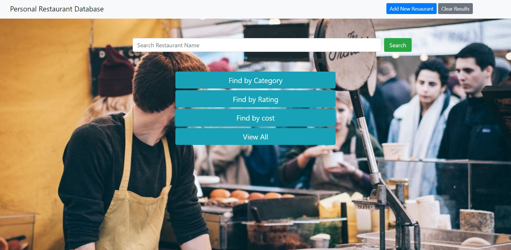
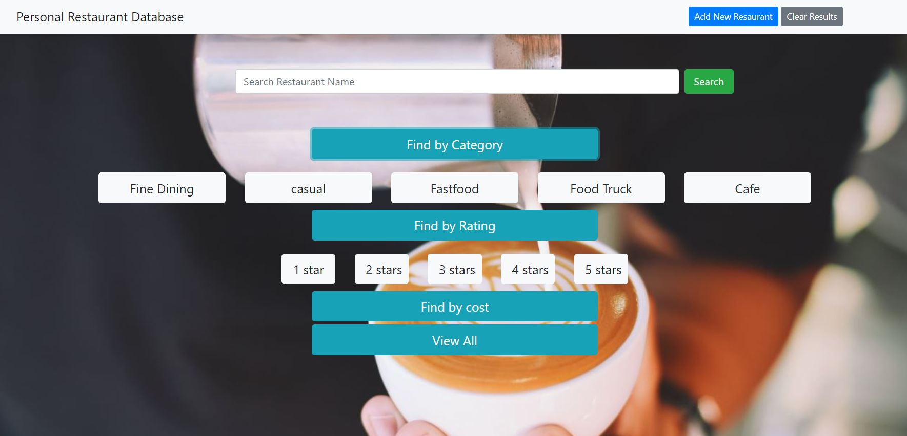
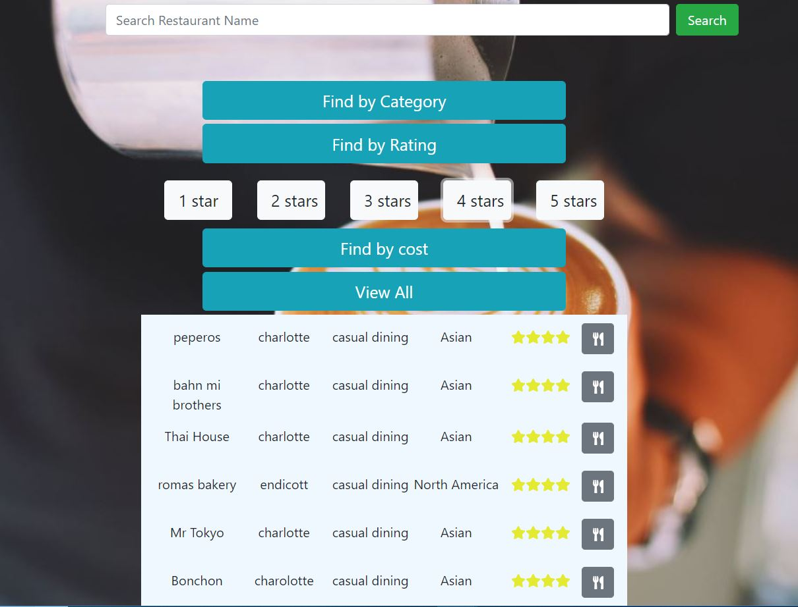
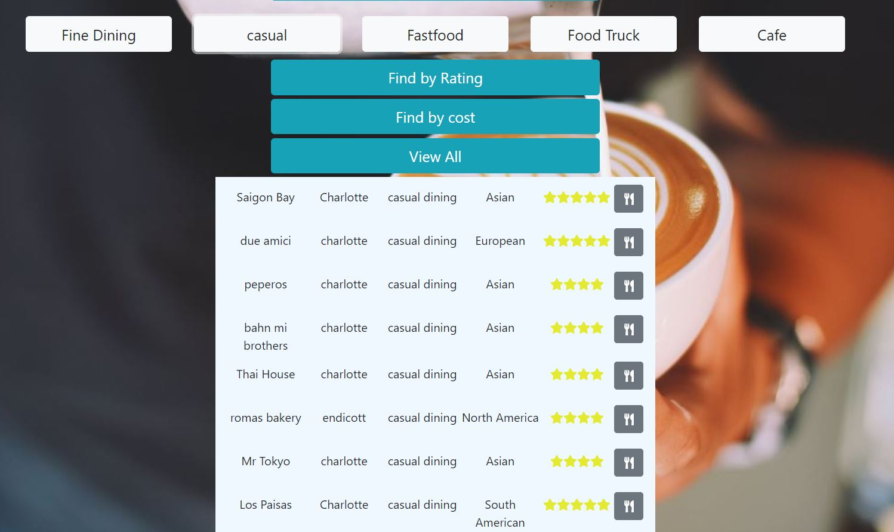
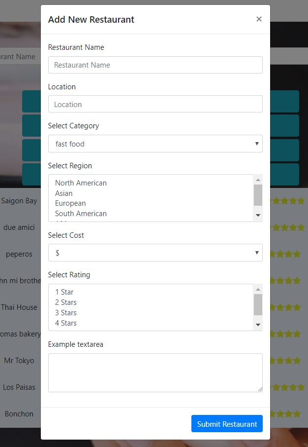

# Restaurant-Database-Frontend

## About
An application that allows you to add information about restaurants in your area. It contains information about the restaurant user submits including:
location, name of restaurant, rating, and price range. The information is stored in a database and can be acccessed even after restarting
the program.

## Technologies used

- HTML5
- CSS3 
- JavaScript
- jQuery
- express
- body-parser
- sequelize
- Bootstrap
- MySQL

## Installation

- in terminal type: npm install

## Screenshots
### Landing Page

### Options displayed by accordion

### Displaying 4 stars Restaurants

### Displaying Casual Category Restaurants

### Modal for adding new Restaurant

## Author
Michael Emmons
